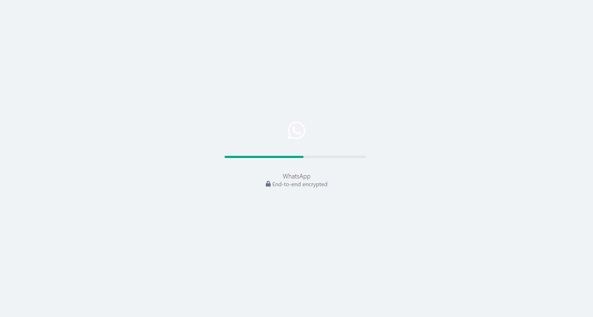

# WhatsApp-React-Clone

>I have developed a WhatsApp clone. I created this project with React and AntDesign.

## ## RULES OF USE

> **STEP-1:** `https://github.com/cavidsuleyman/WhatsAPP-React-Clone.git`  
> **STEP-2:**  enter the `WhatsApp-React-Clone` folder that appears  
> **STEP-3:**  Open the folder you are in in a text editor  
> **STEP-4:**  Open the folder with `cmd` or `Git Bash` and write `npm start`  
> **STEP-5:**  to download the project as `.zip`  [here](https://github.com/cavidsuleyman/WhatsAPP-React-Clone/archive/refs/heads/master.zip) click  

## Technology

This project was developed using the following technologies

| No | Technique | Purpose |
| - | ---------- | --------------------- |
| 1 | React | Create this system |
| 2 | VSCode | Text editor used in the project |
| 3 | AntDesign | React UI library |

## SAMPLE SCREEN APPEARANCE

>It is a Home page, you can search all of the users:

>It is a Loading page:

>You can use a camera here and take photos:

>You can location and message:

>You can use attach menu:

>It is a Community Page:

>It is a New chat page:

>It is an Archive page:

>It is a Profile page:

